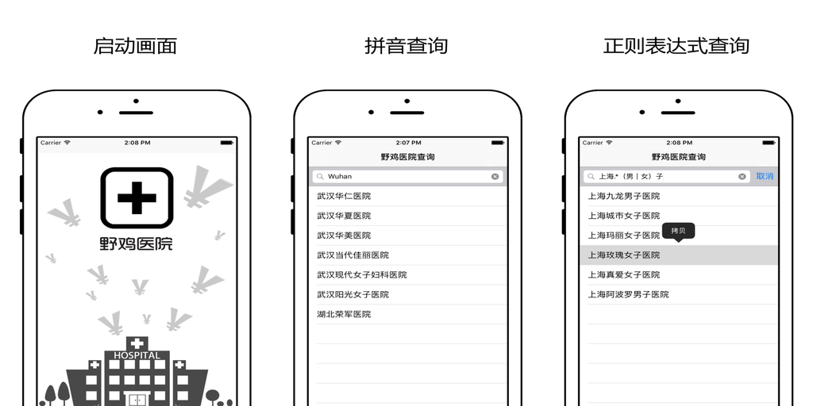

# 使用Go语言开发iOS应用(Swift版)

本文加上读者对Go语言和Swift语言都有一定了解, 但是对二者混合使用不了解的同学.

本教程是基于一个真实上架的iOS应用做的简单的总结。

我们先看看运行效果：



扫码安装：


## 背景

Go语言是Google公司于2010年开源的一个面向网络服务和多并发环境的编程语言，特点是简单。
但是因为简单，也就只能实现90%的性能，这是Go语言的最大优点，因为 少即是多 的道理不是每个人都能领悟的。

Swift是Apple公司于2014年发布的用来替代ObjectiveC的语言，主要面向iOS和OS X上的界面程序开发。
当然用swift来开发服务器也是大家关注的一个领域，作者看好在不远的将来Swift将逐步替代C++和Rust语言。

Go语言和Swift语言本来是风马牛不相及的两个语言，为何非一定要整到一起呢？
原因很简单，因为作者是一个Go粉，同时也算是半个Swift粉；想试水iOS开发，但是实在是受不了ObjectiveC的裹脚布语法。

补充下：本人虽然不喜欢ObjectiveC的语法，但是觉得ObjectiveC的runtime还是很强悍的。
理论上，基于ObjectiveC的runtime，可以用任何流行的编程语言来开发iOS应用，RubyMotion就是一个例子。

其实，现在流行的绝大部分语言都有一个交集，就是c语言兼容的二进制接口。
所以说，C++流行并不是C++多厉害，而是它选择几本无缝兼容了C语言的规范。

但是，完全兼容C语言的规范也有缺点，就是语言本身无法自由地发展，因为很多地方会受到C语言编程模型的限制。
C++和ObjectiveC是两个比较有代表的例子。

所以说，Swift一出世就兼容C语言的二进制接口规范，同时抱紧了ObjectiveC的runtime大腿，而去自己确实有很大优秀的特性。

但是，我们这里暂时不关心Swift和ObjectiveC的混合编程，我们只关注作为ObjectiveC子集的C语言如何与Swift混合编程。

## Swift调用C函数

Swift调用C函数的方法有多种：通过ObjectiveC桥接调用和直接调用。其实两者的原理是一样的，我个人跟喜欢选择最直接也最暴力的直接调用C函数的方式。

比如有一个C函数:

```
#include <stdio.h>

void getInput(int *output) {
    scanf("%i", output);
}
```

生成一个桥接的头文件`xxx-Bridging-Header.h`，里面包含c函数规格说明：

```c
void getInput(int *output);
```

swift就可以直接使用了:

```swift
import Foundation

var output: CInt = 0
getInput(&output)

println(output)
```

如果不用桥接文件，可以在swift中声明一个Swift函数，对应C函数:

```swift
@_silgen_name("getInput") func getInput_swift(query:UnsafePointer<CInt>)
```

为了明确区分C函数和swift函数，我们将`getInput`重新声明为`getInput_swift`，使用方法和前面一样：

```swift
import Foundation

var output: CInt = 0
getInput_swift(&output)

println(output)
```

## Swift中如何管理c返回的内存

Swift语言本身是自带ARC的，用户很少直接关注内存问题。但是C函数如果返回内存到Swift空间，
Swift的ARC是无效的，需要手工释放C内存。

假设我们自己用C语言实现了一个字符串克隆的函数:

```c
char* MyStrDup(char* s) {
	return strdup(s);
}
```

在swift中可以这样使用：

```swift
@_silgen_name("MyStrDup")
func MyStrDup_swift(query:UnsafePointer<CChar>) -> UnsafeMutablePointer<CChar>

let p = MyStrDup_swift("hello swift-c!")
let s = String.fromCString(p)!
p.dealloc(1)
```

使用`String.fromCString(p)!`从C字符串构建一个swift字符串，然后手工调用`p.dealloc(1)`释放c字符串内存空间。

函数调用和内存管理是跨语言编程中最重要的两个基础问题，目前已久初步可以工作了。

## Go语言导出C静态库

Go语言提供了一个cgo的工具，用于Go语言和C语言交互。这是Go语言使用C语言的一个例子:

```go
package main

//#include <stdio.h>
import "C"

func main() {
	C.puts(C.CString("abc"))
}
```

既然要交互，自然会涉及到C语言回调Go语言函数的情形。为此，cgo提供了一个`export`注释命令，
用于生成Go语言函数对应的C语言函数:

```go
//export MyStrDup
func MyStrDup(s *C.char) *C.char {
	return C.strdup(s)
}
```

`MyStrDup`指定的名字必须和Go函数名字一致，函数的参数最后是C语言支持的类型。

现在，我们就得到了用Go语言实现的`MyStrDup`函数，使用方法和前面的C语言实现的`MyStrDup`是一样的。

和引用C语言函数库遇到的问题一样，我们如何在工程中引用这些C代码或Go代码实现的函数呢？

答案还是来自C语言：将代码构建为C静态库或者C动态库，然后将静态库或动态库导入Swift工程。

但是，对于iOS来说，构建C静态库或者C动态库的过程要麻烦（使用xcode也只是隐藏了构建的具体步骤）。

因为，iOS涉及到多种CPU架构：模拟器的x86、4s的32位arm、5s以后的64位arm，64位arm中还有不同当版本...

这是C静态库或者C动态库构建始终都要面对的问题。

## 交叉构建的参数

Go1.6之后增加了构建C静态库的支持，交叉编译也非常简单，只需要设置好`GOARCH`和`GOOS`就行。

因为，iOS的`GOOS`只有`Darwin`一种类型，我们只需要设置`GOARCH`就可以了。

要构建C静态库，我们需要将上面的`MyStrDup`实现放到一个`main`包中:

```go
package main

//#include <string.h>
import "C"

func main() {
	//
}

//export MyStrDup
func MyStrDup(s *C.char) *C.char {
	return C.strdup(s)
}
```

`main`包中的`main`函数不会被执行，但是`init`函数依然有效。

使用下面的命令就可以构建当前系统的c静态库：

	go build -buildmode=c-archive

要交叉编译iOS可用的c静态库，我们需要先设置`GOARCH`，同时打开cgo特性（交叉编译时，cgo默认是关闭的）。

下面是构建针对模拟器的x86/amd64类型的C静态库：

```
export CGO_ENABLED=1
export GOARCH=amd64

go build -buildmode=c-archive -o libmystrdup_amd64.a
```


我们使用`-o`参数指定了输出的静态库文件名。构建命令同时还会生成一个头文件（可能叫`libmystrdup_386.h`），
我们没有用到这个头文件，直接删除掉就可以。

下面是构建针对模拟器的x86/386类型的C静态库：

```
export CGO_ENABLED=1
export GOARCH=386

go build -buildmode=c-archive -o libmystrdup_386.a
```

在构建x86/386类型的C静态库时可能会有一些link错误，我们暂时先用以下方法回避。

创建一个`patch_386.go`文件：

```go
// Copyright 2016 <chaishushan{AT}gmail.com>. All rights reserved.
// Use of this source code is governed by a BSD-style
// license that can be found in the LICENSE file.

// 针对iOS模拟器link时缺少的函数
// 属于临时解决方案

package main

/*
#include <stdio.h>
#include <string.h>
#include <stdlib.h>
#include <time.h>

size_t fwrite$UNIX2003(const void* a, size_t b, size_t c, FILE* d) {
    return fwrite(a, b, c, d);
}

char* strerror$UNIX2003(int errnum) {
    return strerror(errnum);
}

time_t mktime$UNIX2003(struct tm * a) {
    return mktime(a);
}
double strtod$UNIX2003(const char * a, char ** b) {
    return strtod(a, b);
}

int setenv$UNIX2003(const char* envname, const char* envval, int overwrite) {
    return setenv(envname, envval, overwrite);
}
int unsetenv$UNIX2003(const char* name) {
    return unsetenv(name);
}

*/
import "C"
```

当然，还是会有一些警告出现，暂时忽略它们。

## 构建多cpu类型的静态库

然后，将C静态库加入到ios的xcode工程文件就可以了。

x86构建是比较简单的，因为我们可以默认使用本地的构建命令。
但是，如果要构建arm的静态库，则需要先配置好构建环境。

我从Go代码中扣出了一个`clangwrap.sh`脚本（好像是在`$GOROOT/misci/ios`目录）:

```
#!/bin/sh
# This uses the latest available iOS SDK, which is recommended.
# To select a specific SDK, run 'xcodebuild -showsdks'
# to see the available SDKs and replace iphoneos with one of them.
SDK=iphoneos
SDK_PATH=`xcrun --sdk $SDK --show-sdk-path`
export IPHONEOS_DEPLOYMENT_TARGET=7.0
# cmd/cgo doesn't support llvm-gcc-4.2, so we have to use clang.
CLANG=`xcrun --sdk $SDK --find clang`

if [ "$GOARCH" == "arm" ]; then
	CLANGARCH="armv7"
elif [ "$GOARCH" == "arm64" ]; then
	CLANGARCH="arm64"
else
	echo "unknown GOARCH=$GOARCH" >&2
	exit 1
fi

exec $CLANG -arch $CLANGARCH -isysroot $SDK_PATH "$@"
```

里面比较重要的是`IPHONEOS_DEPLOYMENT_TARGET`环境变量，这里意思是目标最低支持ios7.0系统。

构建arm64环境的静态库：

```
export CGO_ENABLED=1
export GOARCH=arm64
export CC=$PWD/clangwrap.sh
export CXX=$PWD/clangwrap.sh

go build -buildmode=c-archive -o libmystrdup_arm64.a
```

构建armv7环境的静态库：

```
export CGO_ENABLED=1
export GOARCH=arm
export GOARM=7
export CC=$PWD/clangwrap.sh
export CXX=$PWD/clangwrap.sh

go build -buildmode=c-archive -o libmystrdup_armv7.a
```

然后我们用`lipo`命令将以上这些不同的静态库打包到一个静态库中：

```
lipo libmystrdup_386.a libmystrdup_adm64.a libmystrdup_arm64.a libmystrdup_armv7.a -create -output libmystrdup.a
```

这样的话，只要引入一个静态库就可以支持不同cpu类型的目标了。

## 总结

毛主席教导我们：要在战争中学习战争。

**[野鸡医院](https://appsto.re/cn/QH8ocb.i)** 这个app是作者第一个iOS应用，这篇教程也是在iOS开发过程逐步学习总结的结果。

完整的例子：

- AppStore安装: https://appsto.re/cn/QH8ocb.i
- Swift工程: https://github.com/chai2010/ptyy/tree/master/ios-app/yjyy-swift
- Go静态库工程: https://github.com/chai2010/ptyy/tree/master/cmd/yjyy
- 静态库构建脚本: https://github.com/chai2010/ptyy/tree/master/ios-app/yjyy-swift/vendor/gopkg

所有的代码均可以免费获取（BSD协议）：https://github.com/chai2010/ptyy
